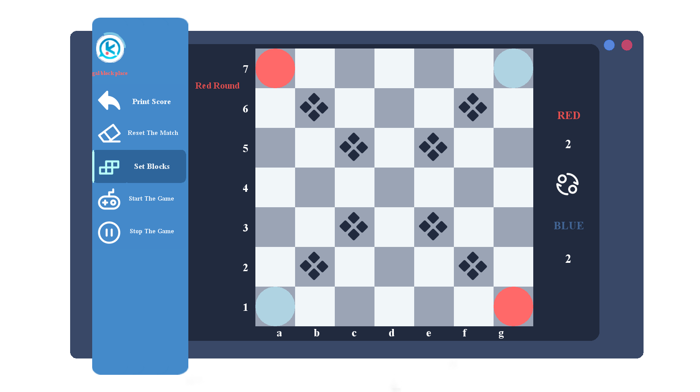
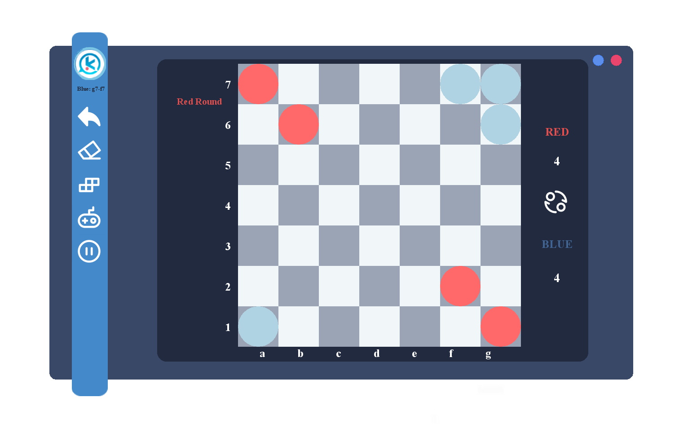

# Ataxx 同化棋 🎲

欢迎来到 Ataxx 同化棋，一款经典的策略棋类游戏，采用 Java 和 Swing 开发，特色在于它的高度定制化界面和流畅的游戏体验。本游戏支持玩家对战（玩家 vs 玩家）和人机对战（玩家 vs AI），并提供了独特的障碍物功能，为您的对局增添更多策略和挑战。

## 🌟 特色功能

- **精美背景轮播**：主界面配备了精美的背景图，利用 Swing 复用组件实现背景图片的轮播，为您的游戏体验增添视觉享受。
- **多种游戏模式**：
    - **玩家 vs 玩家**：面对面的挑战，与朋友共同享受游戏乐趣。
    - **玩家 vs AI**：挑战智能 AI，考验您的策略和技巧。
- **障碍物功能**：增加游戏难度和策略性，可通过界面按钮随机添加或手动放置中心对称的障碍物。
- **实时对局情况展示**：在界面左上角实时显示对局的情况，包括玩家的行动、位置及胜负情况，让比赛的每一步都一目了然。
- **游戏控制**：支持开始、暂停和重新开始游戏的操作，完全掌控您的游戏节奏。

## 📚 游戏玩法

同化棋是一种策略棋类游戏，游戏目标是通过“跳跃”或“复制”移动您的棋子来占领更多的空间。当没有空闲格子时，拥有最多棋子的玩家获胜。

- **跳跃**：跳到距离两格内的空位，相邻的对手棋子将被转化为您的棋子。
- **复制**：复制您的棋子到相邻的空位，同样可以转化周围的对手棋子。
- **障碍物**：棋盘上的障碍物会阻止任何棋子的移动或占领。

## 🛠 开发背景

本游戏使用 Java 语言开发，界面设计采用 Swing。通过复用 Swing 组件和精心设计的游戏逻辑，我们为玩家提供了一个既美观又功能丰富的游戏环境。

## 🚀 开始游玩

要开始游戏，请确保您的计算机上安装了 Java 运行环境。下载游戏后，运行主程序即可进入游戏主界面，并选择您希望的游戏模式开始游玩。

祝您在 Ataxx 同化棋中享受无穷的乐趣和挑战！

## 🖼️ 图片预览
<figure>
  
  <figcaption>Ataxx主界面</figcaption>
</figure>

<figure>
  
  <figcaption>Ataxx主界面轮播(Swing实现)</figcaption>
</figure>

<figure>
  
  <figcaption>加载界面</figcaption>
</figure>

<figure>
  
  <figcaption>玩家对战界面</figcaption>
</figure>

<figure>
  
  <figcaption>游戏功能</figcaption>
</figure>

<figure>
  
  <figcaption>游戏过程</figcaption>
</figure>

<figure>
  
  <figcaption>手动放置障碍物开启</figcaption>
</figure>

<figure>
  
  <figcaption>手动放置障碍物</figcaption>
</figure>

<figure>
  
  <figcaption>AI对战</figcaption>
</figure>

